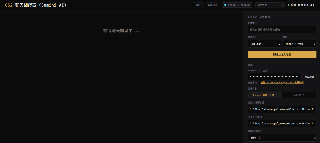
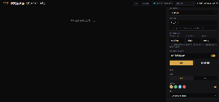
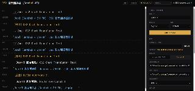
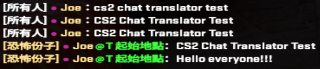

# CS2 聊天翻譯器

即時翻譯 Counter-Strike 2 聊天訊息。支援 Google 翻譯（免費）與 Gemini AI 雙引擎，提供美觀的網頁 GUI 介面。

> **[English README](README.md)**

> **Fork 版本 v2.0.0**  
> 原作者：[MeckeDev](https://github.com/MeckeDev/cs2-chat-translator)  
> 本版修改者：[Joe (JoeJoe1024)](https://github.com/JoeJoe1024)  
> 本版針對 Windows 環境全面優化，新增 Web GUI 功能、Gemini AI 支援、多語言介面、API 金鑰加密等功能。

---

## 為什麼做這個

我是一個熱愛 CS2 的玩家，常常在遊戲裡看不懂隊友或對手想表達什麼，也很想跟他們交流，但語言就是個大障礙。

後來找到了 MeckeDev 這個作者的作品，覺得方向完全對了，但對中文的支援也很有限。於是我開始改它：加上 Windows 支援、網頁 GUI、Gemini AI 翻譯，並把繁體中文、簡體中文以及另外 23 種語言都一起加進來。

希望這個專案能幫到跟我一樣想跨越語言隔閡、卻不想搞一堆技術設定的玩家。

> **維護說明：** 我無法保證會持續更新，畢竟生活中還有很多事要顧。但我有空就會回來看看，有需要就會更新！

---

## 截圖

### Web GUI 介面




### 實際使用效果




---

## 相較原版的新增功能

| 功能 | 說明 |
|------|------|
| ✅ Windows 支援 | 自動偵測 Steam 安裝路徑，原版僅支援 Linux |
| ✅ Gemini AI 引擎 | 可切換 Google Translate / Gemini AI |
| ✅ API 金鑰加密 | AES-256-CBC 加密，綁定本機硬體序號 |
| ✅ 測試金鑰功能 | 一鍵驗證 API 金鑰是否有效，通過後自動儲存 |
| ✅ 清除 / 暫停按鈕 | 清空聊天紀錄、暫停翻譯節省 API 用量 |
| ✅ 25+ 種 UI 語言 | 介面語言即時切換 |
| ✅ 聊天標籤自訂 | 支援非英文 CS2 用戶端（如中文版） |
| ✅ 設定即時生效 | 儲存後無需重啟程式 |
| ✅ 設定檔置於專案資料夾 | 方便備份與攜帶 |

---

## 主要功能

### 翻譯引擎
- **Google 翻譯（免費）** — 無需 API 金鑰，開箱即用
- **Gemini AI** — 需要 Google AI Studio API 金鑰，翻譯品質更高

### 翻譯方式

所有翻譯均可透過 **Web GUI 介面輸入後送出**，不需要在遊戲內聊天室手動打字。

- 舊版：需在遊戲內打出指令 + 訊息才能觸發，且會產生 2 條消息
- **新版**：直接在網頁輸入訊息，按遊戲內快捷鍵，CS2 自動發送

### Web GUI 介面
- 即時顯示聊天紀錄與翻譯結果
- **在網頁輸入文字 → 翻譯 → 按遊戲內快捷鍵送出**，全程不需在遊戲聊天室打字
- **清除** 按鈕：一鍵清空畫面
- **暫停翻譯** 按鈕：節省 API 用量，無需關閉程式
- 支援 25+ 種 UI 介面語言

### 安全性
- API 金鑰以 **AES-256-CBC** 加密儲存
- 加密金鑰由本機**主機板序號 + BIOS 序號**衍生，綁定硬體
- 即使設定檔被複製走，其他電腦也無法解密

---

## 系統需求

- **作業系統：** Windows 10 / 11
- **Node.js：** 18 或以上版本
- **網路：** 需要連線（翻譯 API）
- **遊戲：** Counter-Strike 2，需啟用 `-condebug` 啟動參數

---

## 安裝

### 方式 A：下載 ZIP（推薦，免安裝）

1. 從 [Releases](https://github.com/JoeJoe1024/cs2-chat-translator/releases) 下載最新版 **`cs2-chat-translator-2.0.0.zip`**
2. 解壓縮到任意位置
3. 雙擊 **`start.bat`**
4. 瀏覽器自動開啟 `http://127.0.0.1:7420`

> ZIP 內已附帶 Node.js 執行環境（`runtime\node.exe`）。  
> **不需要安裝 Node.js，不需要執行 npm install**，解壓即用。

### 方式 B：從原始碼執行（適合開發者）

1. 安裝 [Node.js](https://nodejs.org/)（LTS 版）
2. 安裝相依套件：
   ```powershell
   npm install
   ```
3. 啟動：
   ```powershell
   node bin/cs2-chat-translator.js
   ```

在瀏覽器開啟：**http://127.0.0.1:7420**

---

## CS2 遊戲設定

### 步驟 1：啟用 console 記錄

1. 開啟 **Steam**
2. 右鍵 **Counter-Strike 2 → 內容…**
3. 在「**啟動選項**」加入：`-condebug`
4. 啟動 CS2 一次，讓 `console.log` 建立起來

### 步驟 2：找到 cfg 資料夾

Windows 下 Steam 的典型路徑：
```
D:\Steam\steamapps\common\Counter-Strike Global Offensive\game\csgo\cfg
```

### 步驟 3：綁定按鍵

在 `autoexec.cfg` 加入：
```
bind kp_plus "exec chat_reader.cfg"
```
> `kp_plus` 是數字鍵盤的 `+` 鍵。可在 GUI 設定頁面自行修改。

---

## 取得 Gemini API 金鑰（選擇性）

1. 前往 [aistudio.google.com/apikey](https://aistudio.google.com/apikey)
2. 登入 Google 帳號，建立 API 金鑰
3. 在 GUI 設定頁面貼上金鑰，點擊「**測試金鑰**」
4. 測試通過後會**自動儲存**並切換到 Gemini AI 引擎

> 免費版 Gemini 每天有大量請求配額，一般使用已足夠。

---

## 設定頁面說明

| 欄位 | 說明 |
|------|------|
| Gemini API 金鑰 | 選填。不填則自動使用 Google 翻譯 |
| 翻譯引擎 | 切換 Google Translate / Gemini AI，即時生效 |
| Console log 路徑 | CS2 的 `console.log` 完整路徑 |
| CFG 資料夾路徑 | CS2 的 `cfg` 資料夾完整路徑 |
| 自動翻譯語言 | 聊天自動翻譯的目標語言 |
| 綁定按鍵 | CS2 內執行 `chat_reader.cfg` 的按鍵 |
| 聊天標籤前綴 | 如遊戲語言非英文，請修改為對應標籤（繁中：反恐小組 / 恐怖份子 / 所有人） |

設定儲存後**即時生效**，無需重啟程式。

---

## 支援的語言

**翻譯目標語言：** 所有 Google Translate 語言代碼（100+ 種）

**UI 介面語言（25 種）：**
English、繁體中文、简体中文、Русский、Deutsch、Polski、Português、Українська、Français、Español、Türkçe、日本語、한국어、Svenska、Dansk、Suomi、Română、Čeština、ไทย、Tiếng Việt、Bahasa Indonesia、العربية、Nederlands、Magyar、Ελληνικά

---

## 設定檔位置

設定儲存在專案資料夾內的 `config.json`，金鑰欄位為加密格式（非明文）：

```json
{
  "apiKey": "enc:a3f2b1...:8f9e7d...",
  "engine": "gemini",
  "logPath": "D:\\Steam\\steamapps\\common\\...",
  "bindKey": "kp_plus"
}
```

---

## 常見問題

**console.log 找不到**
1. 確認 CS2 啟動參數有加 `-condebug`
2. 在設定頁面確認路徑正確
3. CS2 有實際執行過

**翻譯沒有出現**
1. 確認聊天標籤前綴設定正確（英文 CS2 用 CT/T/ALL）
2. 點擊「**重啟監視器**」讓程式重新讀取設定

**API 金鑰無效**
點擊金鑰欄位旁的「**測試金鑰**」，頁面會顯示詳細錯誤訊息。

---

## 授權

本專案為開源 Fork。原始專案版權歸 [MeckeDev](https://github.com/MeckeDev) 所有，遵循原有授權條款。本版修改內容同樣以相同條款開放。
